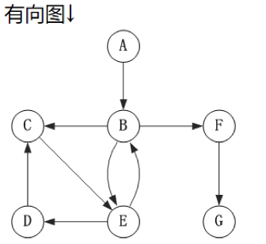
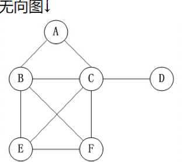

# 图

## 1. 什么是图

图（Graph）是一种非线性数据结构。可以说它是一种比较复杂的数据结构，它比树还要复杂。因为图没有层的概念，它们之间的任意元素都可能产生关系。

## 2. 图的基本知识

（1）顶点：即每个节点

（2）边：两个点连接的先

（3）顶点的度：一个顶点的度是指与该顶点相关联的边的条数，顶点v的度记作d(v)。

（4）出度、入度：对于有向图来说，一个顶点的度可细分为入度和出度。一个顶点的入度是指与其关联的各边之中，以其为终点的边数；出度则是相对的概念，指以该顶点为起点的边数。

（5）有向图/无向图：如果给图的每条边规定一个方向，那么得到的图称为有向图。在有向图中，与一个节点相关联的边有出边和入边之分。相反，边没有方向的图称为无向图。

## 3. 图的存取

### （1）图里有x个点就是 x*x的矩阵。

`A[1][1]`:表示从1到1的情况，`A[1][2]`就表示1到2的情况，有边的就是1,`A[1][2]`=1,没有的就是0 `A[1][3]`=0

### （2）数组加链表

### （3）两种方式的有优缺点

​	数组：浪费空间，但是速度块。数据不大 优先选用数组

​	链表：节省空间，但是速度慢

## 4. 图的遍历

搜索算法：

（1）深度优先遍历（DFS）：大家可以想象玩迷宫，是不是选择一个方向走到底，直到不能走了你在返回一步继续试其他的方向，没错这其实就是深度优先遍历。一条路走到底，递归，有回溯。也要标记走过的点

关键的优化:剪枝

举个例子，从A节点出发，第一次深度优先搜索

A -> B -> C -> E - > D ->

此时，D指向了C，但是C已经走过了，D无路可走了，所以要回溯。

A -> B -> C -> E -> 此时E指向了B，B也已经走过了，所以继续回溯

A -> B -> C ->同理，C也没有路可以走，继续回溯

A -> B -> 此时B还指向了F，所以可以继续向F走

A -> B -> F -> G  这里就遍历完了所有的节点

（2）广度优先遍历（BFS）：类似于树结构的层次遍历，先找到一个点，然后把该点加入队列，依次找出该点的关联边加入队列，循环操作，一直到队列为空。

两个关键点：队列，标记数组，加过的点不能在加。

* 还是从A出发

A -> B 这里A只能到B 

* 然后从B出发

B -> C B ->E B -> F 这里B可以到达三个点

* 然后从C出发

C ->   这里C可以到E，但是E已经被B遍历了，所以C没有可以走的节点

* 然后从E出发

E - > D

* 然后从F出发

F -> G

* 然后从D出发

D -> 这里D可以到C，但是C已经走过，所以没有路可以走

广度优先搜索遍历完成

启发式搜索，A*

